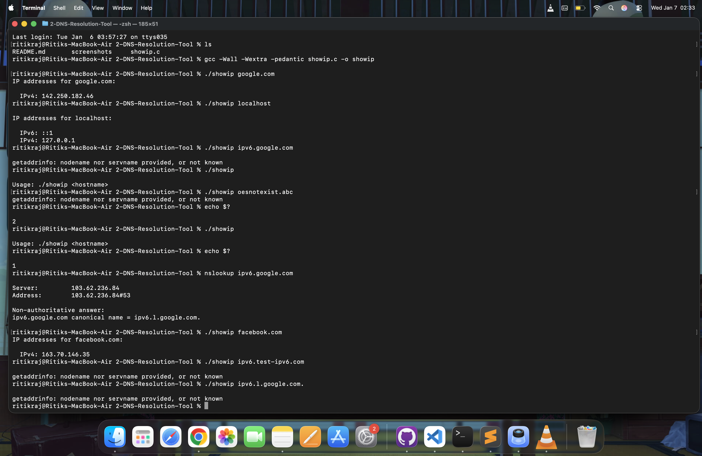

# 📡 showip — Hostname to IP Resolver (IPv4 & IPv6)

A minimal C program that demonstrates **hostname-to-IP address resolution** using the POSIX `getaddrinfo()` API.

It resolves **both IPv4 and IPv6** addresses and prints all results returned by the system’s DNS resolver.

This project is ideal for learning:

- DNS resolution at the OS level
- IPv4 vs IPv6 handling
- `getaddrinfo()` and `inet_ntop()`
- Portable, protocol-independent network programming in C

---

## 📁 Repository Structure

```text
showip/
├── showip.c        # Main source file
└── README.md       # Project documentation
```

## 🛠 Compilation

Compile using gcc with recommended warnings enabled:
```bash
gcc -Wall -Wextra -pedantic showip.c -o showip
```
---
## ▶️ Usage
```bash
./showip <hostname>
```

Example:
```bash
./showip google.com
```

Sample Output:
```bash
IP addresses for google.com:

  IPv4: 142.250.183.14
  IPv6: 2404:6800:4009:80a::200e
```

Note: Output may vary depending on DNS configuration and geographic location.

---
## 🖥️ Example Runs & Screenshots

This repository also includes real execution examples, such as:
- Running showip against localhost and public domains
- Multiple client connections resolving the same host
- IPv6 loopback (::1) resolution
- Testing via tools like nc, curl, and custom clients


📸 Terminal screenshots are included above to demonstrate real execution output on macOS.


## 🧠 How the Program Works

- Accepts a hostname as a command-line argument
- Uses getaddrinfo() to perform DNS resolution
- Receives a linked list of address structures
- Detects IPv4 or IPv6 using ai_family
- Converts binary IP addresses to readable strings using inet_ntop()
- Prints all resolved addresses

## 🧩 Key APIs and Headers
| Component        | Purpose                        |
| ---------------- | ------------------------------ |
| `getaddrinfo()`  | Hostname to address resolution |
| `inet_ntop()`    | Binary IP → text conversion    |
| `<netdb.h>`      | Network database functions     |
| `<sys/socket.h>` | Socket address structures      |
| `<arpa/inet.h>`  | IP address utilities           |

This program is protocol-independent and does not hardcode IPv4 or IPv6 logic.

---

## 🚨 Error Handling
- Incorrect usage → exits with status 1
- DNS resolution failure → exits with status 2
- Uses gai_strerror() instead of errno for DNS errors

---

## 🧹 Memory Safety
- memset() prevents undefined behavior
- freeaddrinfo() prevents memory leaks
- No user-managed heap allocations
---
