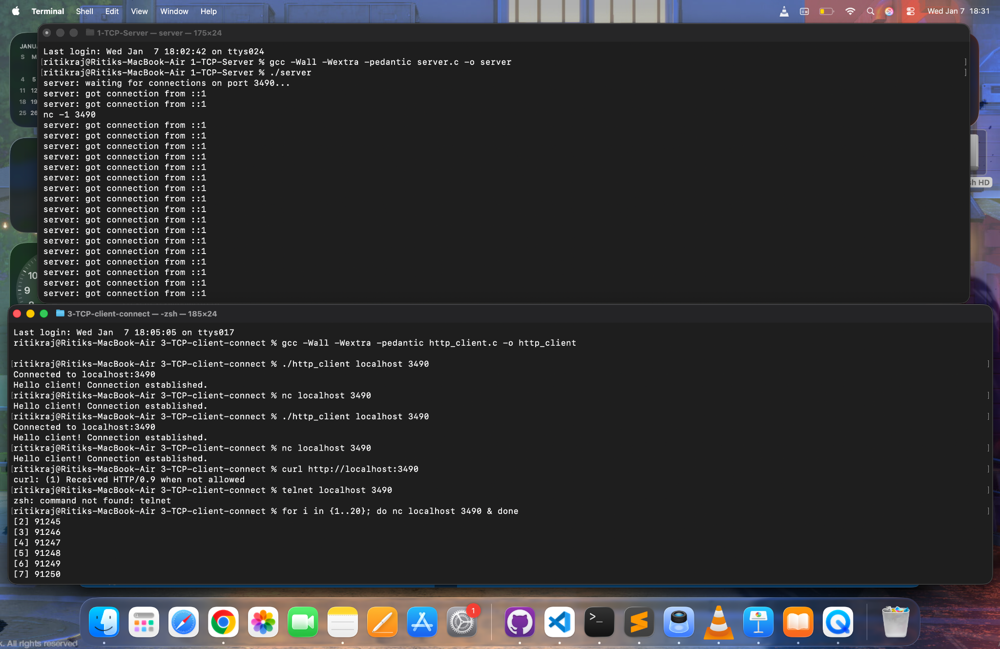

# 🚀 TCP Client using POSIX Sockets (C)

This repository implements a **TCP client** using **POSIX system calls** in C.  
The client supports **IPv4 and IPv6**, performs **DNS + service resolution**, connects to a remote server using `connect()`, and exchanges data over TCP.

The focus of this project is **systems-level understanding**: how user programs interact with the OS kernel during network communication.

---

## 📁 Repository Structure

```text
3-TCP-client-connect/
├── client.c
├── screenshots/
│   ├── client-connect-localhost.png
│   ├── multiple-client-connections.png
│   └── stress-test-connections.png
└── README.md
```


---

## 📌 Key Features

- ✅ IPv4 + IPv6 support (`AF_UNSPEC`)
- ✅ DNS hostname resolution (`getaddrinfo`)
- ✅ Service resolution (`http` → port 80)
- ✅ Robust connection attempts across multiple addresses
- ✅ Client-side socket creation
- ✅ `connect()` without explicit `bind()`
- ✅ Kernel-assigned **ephemeral ports**
- ✅ TCP data exchange using `send()` and `recv()`
- ✅ Proper kernel resource cleanup

---

## 🧠 High-Level Client Flow

<pre>
  User input (hostname, port)
            ↓
DNS + service resolution (getaddrinfo)
            ↓
        Create socket
            ↓
 connect() to remote server
            ↓
 Kernel assigns ephemeral port
            ↓
       Send request
            ↓
     Receive response
            ↓
       Close socket
</pre>

---


---

## 🧑‍💻 Build & Run

### Compile
```bash
gcc -Wall -Wextra -pedantic client.c -o client
```

### Run
```bash
./client www.example.com 80
```

### Example (local server):
```bash
./client localhost 3490
```

---

## 🔧 POSIX System Calls Used
| System Call     | Purpose                       | Kernel Involvement            |
| --------------- | ----------------------------- | ----------------------------- |
| `getaddrinfo()` | DNS + service resolution      | Uses system resolver          |
| `socket()`      | Create communication endpoint | Allocates kernel socket       |
| `connect()`     | Connect to remote host        | TCP handshake                 |
| `send()`        | Send data                     | Copies data to kernel buffers |
| `recv()`        | Receive data                  | Reads kernel receive buffer   |
| `close()`       | Cleanup                       | Frees socket & connection     |

---

## 🌐 DNS + Service Resolution
```bash
getaddrinfo(hostname, service, &hints, &res);
```

- DNS resolution:
```google.com → 142.250.x.x```

- Service resolution:
```"http" → TCP port 80```

Service resolution is performed by the operating system, not DNS.


This allows:
- Named services (http, https)
- Numeric ports (80, 443)
- Protocol selection (TCP / UDP)

### 🔁 Why Try Every Address?
```bash
for (p = res; p != NULL; p = p->ai_next) {
    socket();
    connect();
}
```
Required for real-world robustness because:
- A hostname may resolve to multiple IPs
- Some IPs may be unreachable
- IPv6 may fail while IPv4 works
- Production clients must tolerate partial failures

This is exactly how browsers, curl, and databases behave.

---

## 🔐 Ephemeral Ports Explained

This client does not call bind().

Instead:
- The kernel automatically assigns:
  - Local IP
  - Ephemeral port (temporary client port)

Ephemeral ports:
- Are short-lived
- Prevent port conflicts
- Enable large numbers of concurrent clients
- Are invisible to the application

---

## 📡 HTTP Request Explained

```const char *request = "GET / HTTP/1.0\r\n\r\n";
send(sockfd, request, strlen(request), 0);
```
- This is raw HTTP protocol text
- Not HTML
- Not an API call
- Not JSON

HTTP is a plain-text application-layer protocol sent over TCP.

The server parses this request and sends a response (HTML, JSON, etc.).

---

## 📥 Receiving Data from TCP

``` bash
while ((bytes = recv(sockfd, buffer, sizeof buffer - 1, 0)) > 0) {
    buffer[bytes] = '\0';
    printf("%s", buffer);
}
```

Key points:
- TCP is a byte stream
- No message boundaries
- Data arrives in chunks
- Loop ends when server closes the connection
HTTP/1.0 signals end-of-response by closing the connection.

---

## 🧪 Tested With
- Custom fork-based TCP server
- nc (netcat)
- curl
- Multiple concurrent clients
- IPv4 & IPv6 loopback

---

## 📸 Screenshots
This repository includes screenshots showing:
- Client connecting to a local TCP server
- Multiple concurrent client connections
- Stress testing using background nc clients
- Kernel behavior during high connection volume


1. Client Connecting to Local TCP Server
- Shows successful connection to `localhost:3490`.

2. Multiple Concurrent Client Connections
- Demonstrates multiple clients connecting simultaneously using `nc`.

3. Stress Testing and Resource Limits
- Shows OS limits being reached during heavy connection bursts.




---
## 🏁 Summary

This project demonstrates:
- How TCP clients work internally
- How applications interact with the kernel
- Why connect() does not require bind()
- How DNS, services, sockets, and TCP fit together
- Production-grade robustness patterns

It serves as:
- 📘 A learning reference for network programming
- 🧠 Proof of systems-level understanding
- 🚀 A foundation for event-driven networking

---