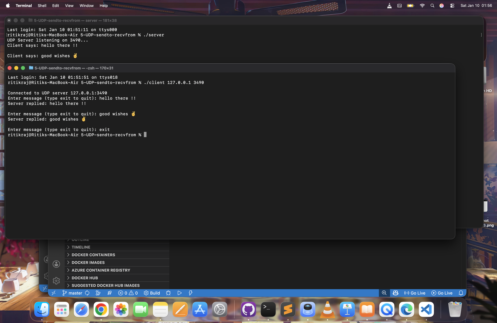
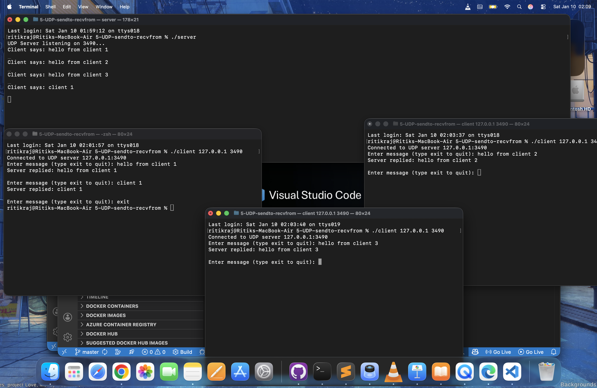
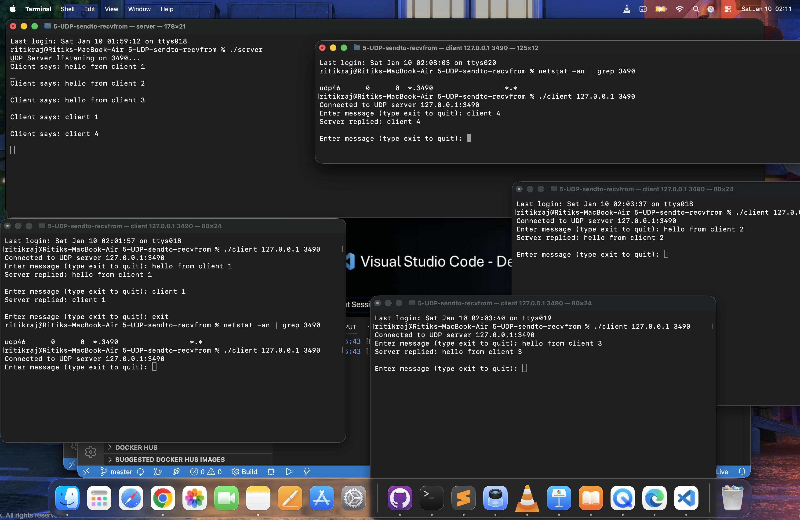

# UDP Echo Client-Server in C

A simple **UDP Client-Server application** written in C that demonstrates
connectionless communication using `sendto()` and `recvfrom()`.

This project shows how **multiple clients** can communicate with a **single server**
simultaneously using UDP sockets.

---

## 🚀 Project Highlights

- Connectionless communication  
- Multiple clients → single server  
- IPv4 & IPv6 support  
- Clean, commented code  
- Terminal based interaction  
- Echo server implementation  

---

## 📂 Project Structure

```text
udp-echo-client-server/
│
├── screenshots/
│ ├── demo-1.png
│ ├── demo-2.png
│ └── demo-3.png
│
├── client.c
├── server.c
└── README.md
```


---

## 🖼 Demo Output

### Screenshot 1

(Shows server running and one client communicating)

### Screenshot 2

(Shows multiple clients sending messages to one server)

### Screenshot 3

(Shows netstat + client activity proving different source ports)

---

## 🔍 What is happening here?

From the screenshots, you can observe:

- One UDP server running on port **3490**  
- Multiple clients running in different terminals  
- Each client sends messages like:
    ```text
    hello from client 1
    hello from client 2
    hello from client 3
    ```
- Server receives all messages:
    ```text
    Client says: hello from client 1
    Client says: hello from client 2
    Client says: hello from client 3
    ```


- Server echoes each message back  
- Clients receive the echoed responses  

---

## 💡 Why does this work with UDP?

UDP is **connectionless**:

- No handshake  
- No connection state  
- Every packet contains sender address  
- Server replies using that address  

So:

```text
Client 1 ─┐
Client 2 ─┼──> UDP Server
Client 3 ─┘
```

The OS automatically assigns each client a **different source port**, even though
they all connect to: `127.0.0.1:3490`


That is why server can distinguish between clients.

---

## ⚙ How the Server Works

1. Creates UDP socket  
2. Binds to port 3490  
3. Waits using `recvfrom()`  
4. Receives message + client address  
5. Prints message  
6. Sends same message back using `sendto()`  

---

## ⚙ How the Client Works

1. Takes server IP & port from CLI  
2. Creates UDP socket  
3. Sends message to server  
4. Waits for echo  
5. Prints response  
6. Type `exit` to quit  

---

## 🛠 Compilation

```bash
gcc server.c -o server
gcc client.c -o client
```

---

## ▶ How to Run
Terminal 1 (Server):

```text
./server
```

Terminal 2,3,4 (Multiple Clients):
```text
./client 127.0.0.1 3490
```

You can open any number of terminals and run clients.

---

## 📌 Sample Run

Client:

```text
Enter message (type exit to quit): hello from client 1
Server replied: hello from client 1
```


Server:

```text
Client says: hello from client 1
```


---

## 🧠 Learning Outcomes

- Difference between TCP & UDP
- Connectionless networking
- How sockets work internally
- How OS assigns ephemeral ports
- Real-time communication
- Multi-client handling

---