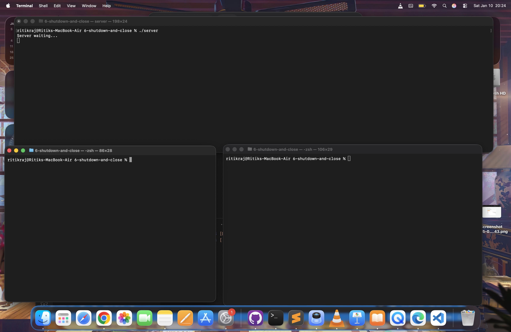
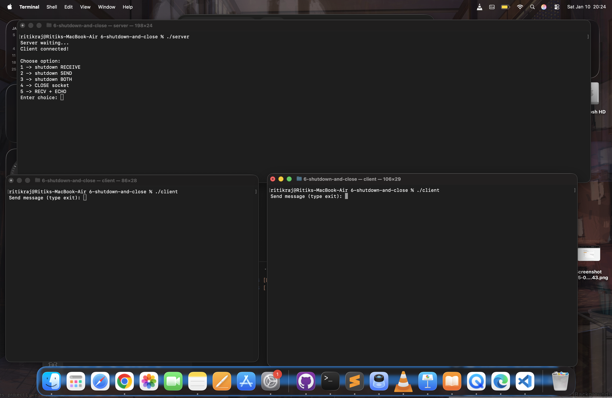
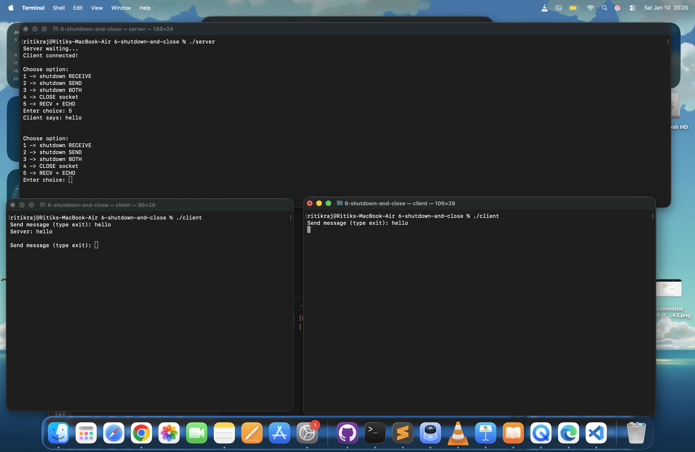
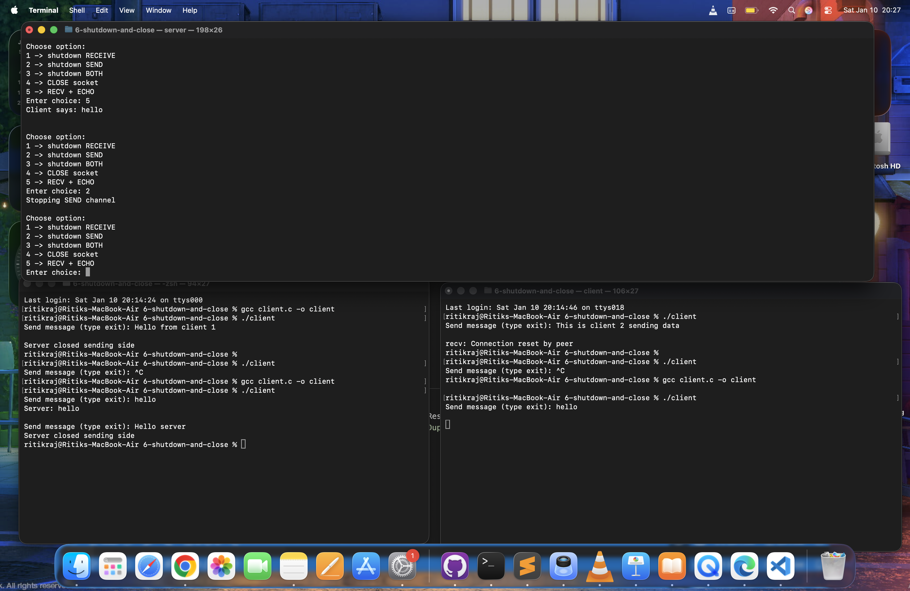
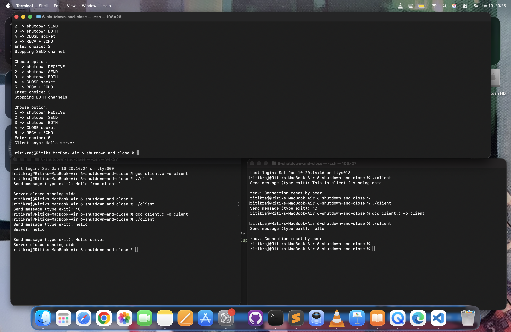

---

# 🔌 TCP Shutdown vs Close – Socket Programming Demo (C)

This project demonstrates the difference between shutdown() and close() in TCP socket programming using C.
It also shows how multiple clients interact with a single server and how communication flow can be controlled at runtime.


---

## 📌 Key Concepts Covered

- TCP client–server communication
- Difference between:
    - shutdown(SHUT_RD)
    - shutdown(SHUT_WR)
    - shutdown(SHUT_RDWR)
    - close()
- Half-close vs full-close connections
- Server-controlled communication flow
- Multiple clients connecting to one server

---

## 📂 Project Structure

```text
6-shutdown-and-close/
│
├── server.c      # Interactive TCP server
├── client.c      # TCP client
│
├── screenshots/
│   ├── server-waiting.png
│   ├── client-connected-menu.png
│   ├── normal-echo.png
│   ├── shutdown-send.png
│   ├── shutdown-both.png
│   └── close-socket.png
│
└── README.md
```

---

## ⚙️ Compilation & Execution

Compile:

```bash
gcc server.c -o server
gcc client.c -o client
```

Run Server:
```bash
./server
```

Run Clients (in multiple terminals):
```bash
./client
```

---

## 🧪 Runtime Options (Server Side)

Once a client connects, the server shows:

```bash
Choose option:
1 -> shutdown RECEIVE
2 -> shutdown SEND
3 -> shutdown BOTH
4 -> CLOSE socket
5 -> RECV + ECHO
```

| Option | Action           | Meaning                 |
| ------ | ---------------- | ----------------------- |
| 1      | shutdown RECEIVE | Server stops receiving  |
| 2      | shutdown SEND    | Server stops sending    |
| 3      | shutdown BOTH    | Server stops both       |
| 4      | CLOSE socket     | Fully closes connection |
| 5      | RECV + ECHO      | Normal echo mode        |

---

## 📸 Screenshot Explanation

### 1️⃣ Server Waiting

Shows server started and waiting for connections.



---

### 2️⃣ Client Connected

Client connects successfully and control menu appears.



---

### 3️⃣ Normal Echo (Option 5)

Server receives message and echoes it back.



---

### 4️⃣ shutdown(SEND)

Server stops sending.



Client sees:

```bash
Server closed sending side
```

---

### 5️⃣ shutdown(BOTH)

Server stops both send & receive.



Client sees:

```bash
Connection reset by peer
```

---

### 6️⃣ close()

Socket fully closed by OS.

Client gets:

```bash
Connection reset by peer
```

---

## 🧠 What This Project Demonstrates

| Function            | Behavior             |
| ------------------- | -------------------- |
| shutdown(SHUT_RD)   | Stop receiving only  |
| shutdown(SHUT_WR)   | Stop sending only    |
| shutdown(SHUT_RDWR) | Stop both            |
| close()             | Fully destroy socket |

---

## 🔥 Multiple Clients Test

You successfully ran:

```bash
./client
./client
```

- All clients connected to the same server
- Server handled them sequentially
- Demonstrates real-world multi-client behavior


---

## 🛠 Technologies Used

- C programming
- POSIX socket API
- TCP protocol
- Linux / Mac terminal


---

## 🎯 Learning Outcome

This project helps understand:
- Real socket state transitions
- Graceful connection shutdown
- Difference between half-close & full-close
- How production servers manage connections


---