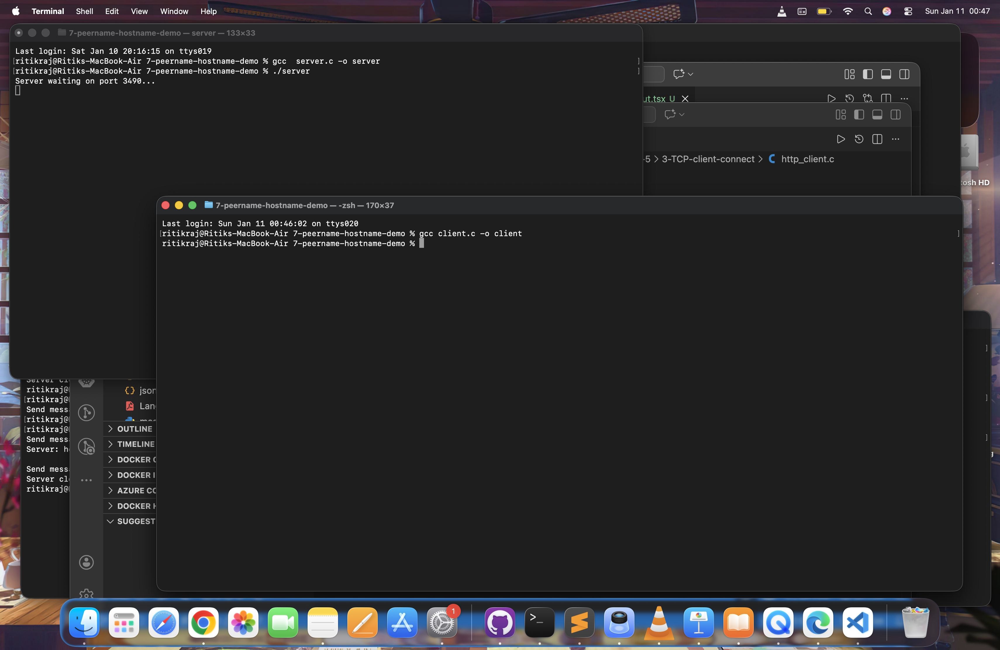
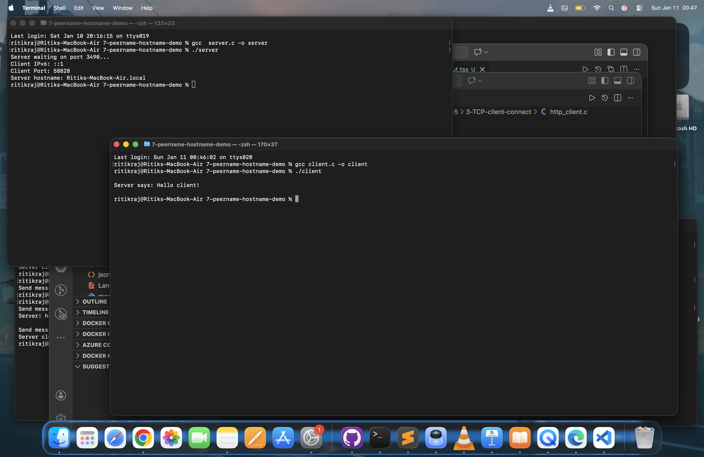
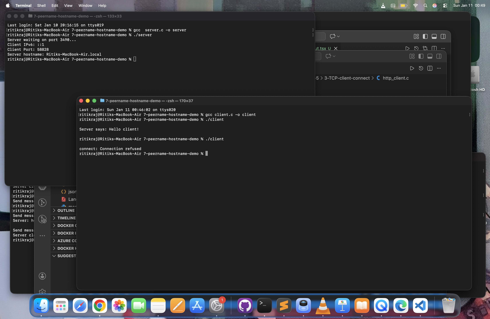
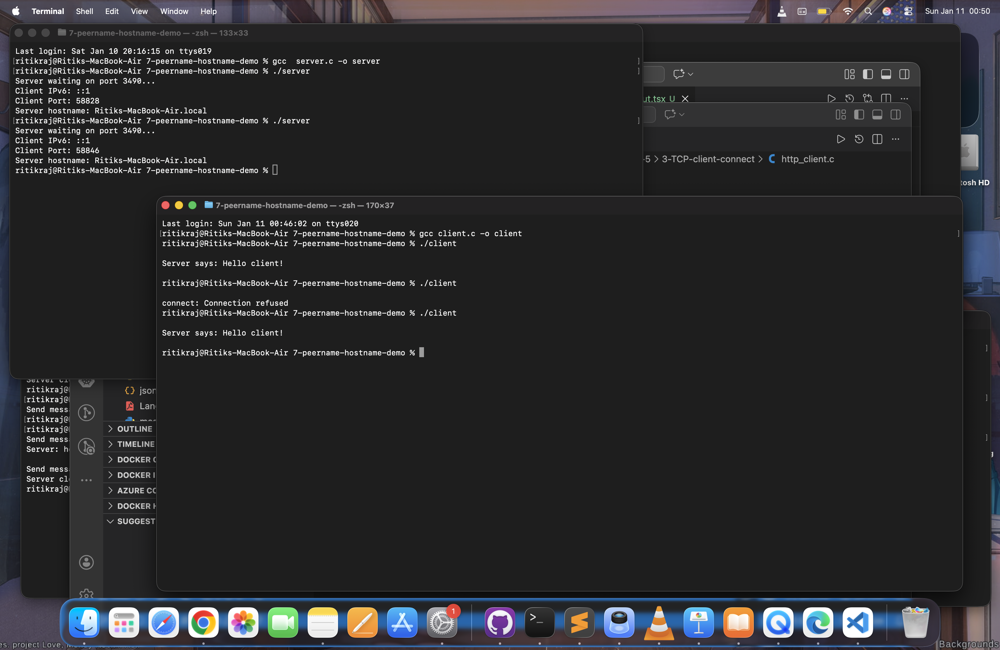

# 📡 TCP Server–Client Demo
Using getpeername() and gethostname()

This project demonstrates real TCP client–server communication in C using sockets.
It shows:
- How a server accepts client connections
- How to identify the connected client using getpeername()
- How the server identifies itself using gethostname()
- Proper socket creation, binding, listening, and closing
- Handling multiple client runs

---

## 🗂 Project Structure

```text
7-peername-hostname-demo/
│
├── server.c
├── client.c
├── screenshots/
│   ├── server_waiting.png
│   ├── client_connected.png
│   └── multiple_clients.png
└── README.md
```

---

## ⚙️ Features

Server:
- Listens on port 3490
- Accepts incoming TCP connections
- Displays:
    - Client IP address
    - Client port number
    - Server hostname
- Sends greeting message to client

Client:
- Connects to server using TCP
- Receives greeting message
- Displays server response

---

## 🧪 How to Run

### 1️⃣ Compile:

```bash
gcc server.c -o server
gcc client.c -o client
```

### 2️⃣ Start Server (Terminal 1)

```bash 
./server
```

Expected output:
```bash
Server waiting on port 3490...
```

### 3️⃣ Run Client (Terminal 2)

```bash 
./client
```

Expected output:

```bash
Server says: Hello client!
```


---

## 📸 Screenshots

### 🔹 Server Waiting



Shows server listening for incoming connections

---


### 🔹 Client Connected



Shows client successfully connected and receiving message


---


### 🔹 Server refused Client's request



Shows client successfully connected and server was not eastablished


---

## 📌 Observations

The server stops after one client because:
- It accepts only one connection
- Then closes socket intentionally
- When client is run without server running:

    ```bash
    connect: Connection refused
    ```


This proves real TCP behavior.

---


## 🧠 Learning Outcomes

- TCP socket programming
- getpeername() usage
- gethostname() usage
- Client - server lifecycle
- Error handling
- Port reuse using setsockopt()

---
