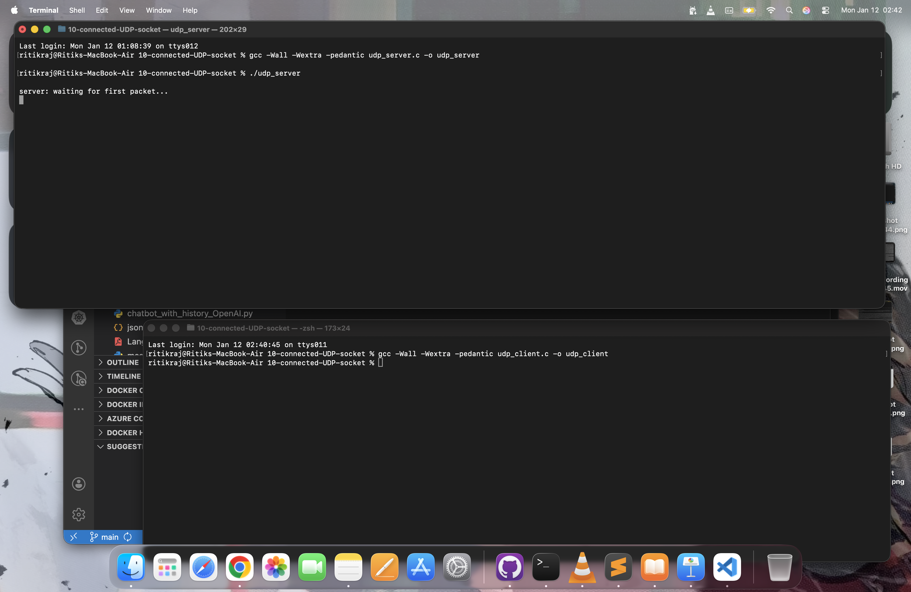
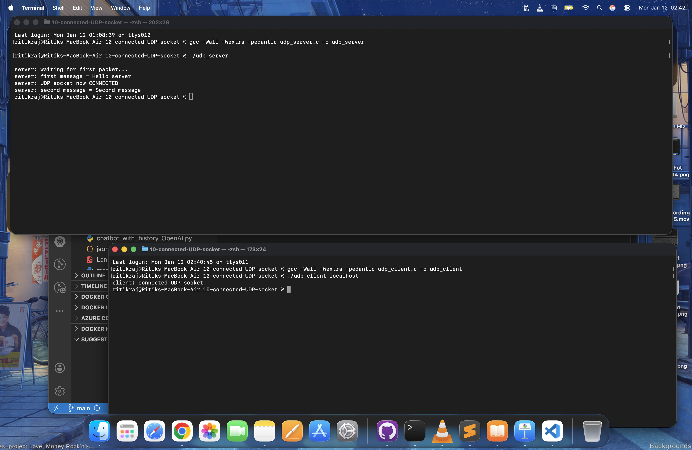

# Connected UDP Socket (C)

This project demonstrates connected UDP sockets in C using POSIX system calls.

Unlike normal UDP programs that use ```sendto()``` and ```recvfrom()```, this implementation uses:
- ```connect()``` on a UDP socket
- ```send()``` instead of ```sendto()```
- ```recv()``` instead of ```recvfrom()```

This shows how UDP can behave like a connection-oriented socket without any handshake.

---

## 📂 Project Structure

```text
10-connected-UDP-socket/
├── udp_server.c
├── udp_client.c
├── screenshots/
│   ├── server-running.png
│   ├── client-running.png
│   └── message-flow.png
└── README.md
```

---

## 🎯 Concepts Demonstrated

- UDP sockets ( ```SOCK_DGRAM``` )
- IPv6 networking
- ```connect()``` on datagram sockets
- Difference between:
    - ```send()``` vs ```sendto()```
    - ```recv()``` vs ```recvfrom()```
- Kernel peer locking
- Blocking system calls
- Real kernel behavior for UDP

---

## ⚙️ Compilation

### Server
```text
gcc -Wall -Wextra -pedantic udp_server.c -o udp_server
```

### Client
```text
gcc -Wall -Wextra -pedantic udp_client.c -o udp_client
```

---

## ▶️ How To Run

### Step 1: Start server
```text
./udp_server
```

Expected output:
```text
server: waiting for first packet...
```

---


### Step 2: Run client (new terminal)
```text
./udp_client localhost
```

Expected output:
```text
client: connected UDP socket
```

---

### Server output after client runs:

```text
server: first message = Hello server
server: UDP socket now CONNECTED
server: second message = Second message
```

---


## 🧠 What’s Happening Internally?

### 1️⃣ Server
- Creates UDP socket
- Binds to port 5050
- Receives first packet using ```recvfrom()```
- Extracts client address
- Calls ```connect()``` to lock socket to that client
- Uses recv() for further communication

---

### 2️⃣ Client

- Creates UDP socket
- Calls ```connect()``` to server
- Sends messages using ```send()```
- Kernel automatically fills destination address

---

## 🚀 Why Connected UDP?

Calling ```connect()``` on a UDP socket:
- Removes need to specify destination every time
- Allows use of ```send()``` and ```recv()```
- Kernel filters packets from only that peer
- Still NO reliability, NO handshake

---

## 📸 Screenshots

### Server Running



### Message Flow



---

### 📚 References
- Beej’s Guide to Network Programming
- ```man socket```
- ```man connect```
- ```man send```
- ```man recv```
- ```man recvfrom```

---

