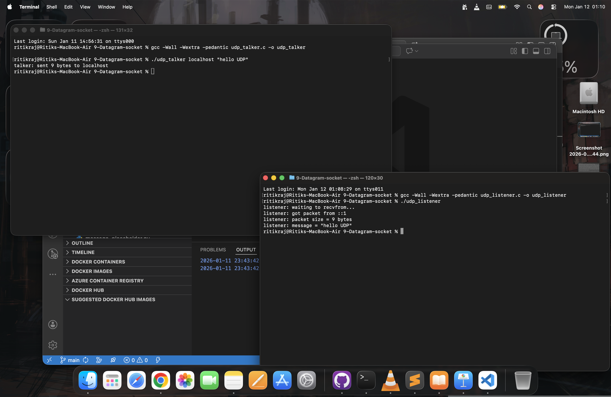

# 📡 UDP Datagram Socket Communication (C)

This project demonstrates connectionless UDP communication using POSIX sockets in C.

It implements:

- udp_listener.c → Receives datagrams using recvfrom()
- udp_talker.c → Sends datagrams using sendto()

Both programs use IPv6, follow modern getaddrinfo() practices, and clearly show how UDP works internally.

---

## 📂 Project Structure

```text
9-Datagram-socket/
│
├── udp_listener.c
├── udp_talker.c
├── screenshots/
│   ├── udp-listener-waiting.png
│   ├── udp-message-received.png
│   └── udp-talker-sent.png
└── README.md
```

---

## 🎯 What This Project Demonstrates
- UDP sockets (SOCK_DGRAM)
- IPv6 networking
- sendto() and recvfrom()
- Connectionless communication
- Sender address extraction
- No listen() / accept() needed
- Real OS networking behavior

---

## 🧠 Key Concepts

### 🔹 UDP (User Datagram Protocol)
- Connectionless
- No handshake
- No delivery guarantee
- No ordering guarantee
- Very fast
- Used in:
    - DNS
    - Video streaming
    - Online games
    - VoIP


---

### 🔹 sendto()

```text
sendto(sockfd, buffer, length, 0, addr, addrlen);
```

sendto(sockfd, buffer, length, 0, addr, addrlen);

---

### 🔹 recvfrom()

```text
recvfrom(sockfd, buffer, size, 0, &sender_addr, &addrlen);
```

Receives a packet and also gives sender info.

---


## ⚙️ Compilation

```bash
gcc -Wall -Wextra -pedantic udp_listener.c -o udp_listener
gcc -Wall -Wextra -pedantic udp_talker.c -o udp_talker
```

---

## ▶️ Running the Programs

### Terminal 1 (Listener)

```text
./udp_listener
```

Output:
```text
listener: waiting to recvfrom...
```

---

### Terminal 2 (Talker)

```text
./udp_talker localhost "hello UDP"
```

Output:
```text
talker: sent 9 bytes to localhost
```

---

Listener Output:

```text
listener: got packet from ::1
listener: packet size = 9 bytes
listener: message = "hello UDP"
```

---

## 📸 Screenshots

### 🔹 Listener Waiting


---

### Talker Sending Message and Message Received



---

## 🧪 Observations

- No server startup needed
- Talker can send even if listener isn’t running
- Packets may disappear
- No retries
- No acknowledgements


This shows real UDP behavior:

| Feature     |  TCP        | UDP     |
| ----------- | ----------  | ------  |
| Connection  |  Yes        | No      |
| Reliability |  Guaranteed | No      |
| Ordering    |  Guaranteed | No      |
| Speed       |  Medium     | Fast    |
| Overhead    |  High       | Low     |


---

## 🏁 Summary

This project provides:
- 📘 Deep understanding of UDP
- 🧠 Kernel networking behavior
- 🚀 Foundation for real-world protocols

---

