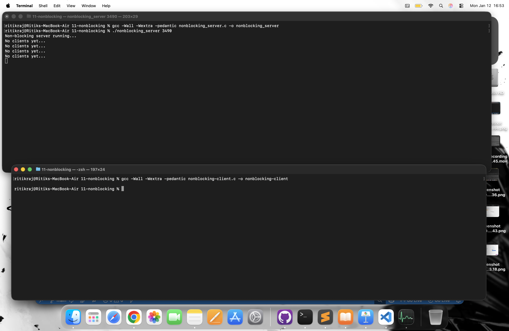
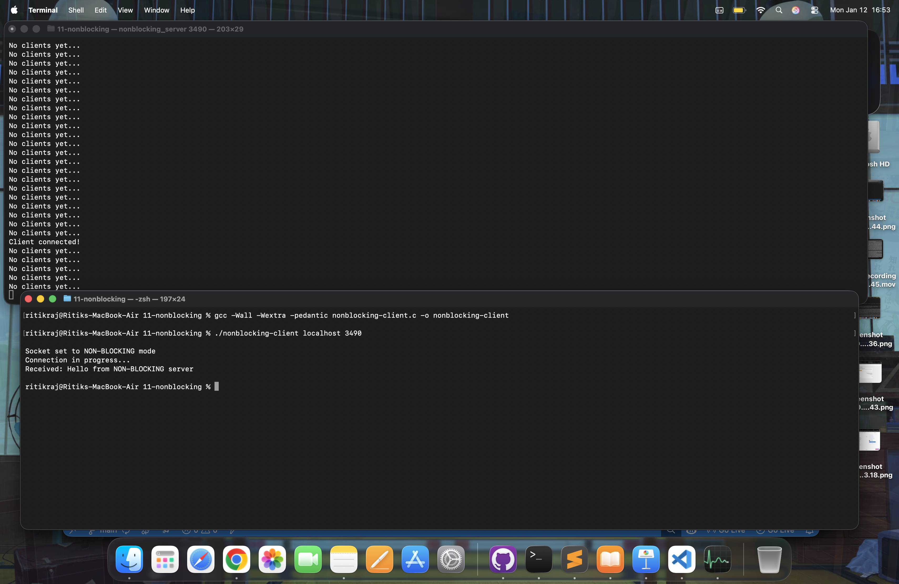
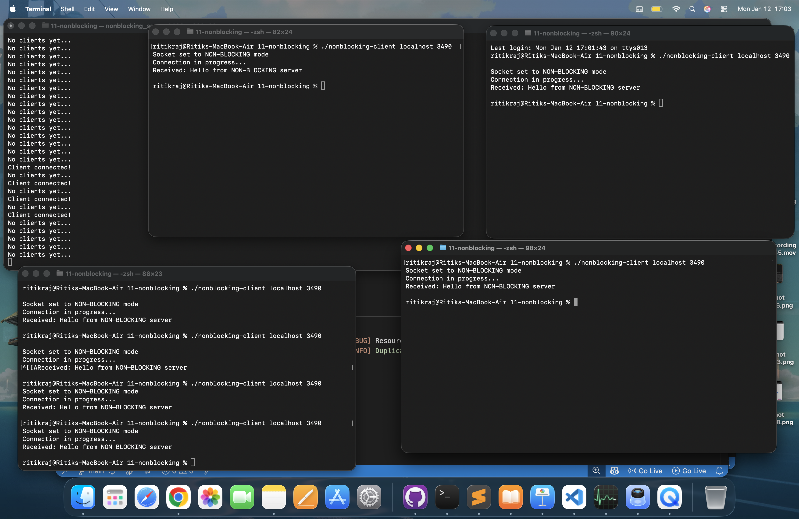

# ⚡ Non-Blocking TCP Server–Client in C

This project demonstrates **non-blocking socket programming** in C using:

- `socket()`
- `fcntl()` for `O_NONBLOCK`
- Non-blocking `accept()`
- Non-blocking `connect()`
- Handling `EAGAIN` / `EWOULDBLOCK`
- Real TCP client–server communication

---

## 🚀 Features

### Server
- Runs in **non-blocking mode**
- Does NOT freeze while waiting for clients
- Uses `fcntl()` to enable `O_NONBLOCK`
- Prints:
  - "No clients yet..." when idle
  - "Client connected!" when client connects
- Sends greeting message to each client

### Client
- Uses **non-blocking socket**
- Handles:
  - `EINPROGRESS` during connect
  - `EAGAIN / EWOULDBLOCK` during recv
- Receives and prints server message

---

## 🧠 Concepts Demonstrated

- Blocking vs Non-blocking sockets
- `fcntl()` socket flags
- Error handling with `errno`
- TCP connection lifecycle
- Busy polling behavior
- Why `poll()` / `select()` is better than busy waiting

---

## ⚙️ Compilation

```bash
gcc -Wall -Wextra -pedantic nonblocking_server.c -o nonblocking_server
gcc -Wall -Wextra -pedantic nonblocking_client.c -o nonblocking_client
```


---


## 📁 Repository Structure

```text
nonblocking-socket-demo/
│
├── nonblocking_server.c
├── nonblocking_client.c
├── screenshots/
│   ├── server-running.png
│   ├── client-connected.png
│   ├── multiple-clients.png
│
└── README.md
```

---

## ▶️ Running

### 1️⃣ Start Server (Terminal 1)

```text
./nonblocking_server 3490
```


Expected output:

```text
Non-blocking server running...
No clients yet...
No clients yet...
```


### 2️⃣ Run Client (Terminal 2)
```text
./nonblocking_client localhost 3490
```


Expected output:

```text
Socket set to NON-BLOCKING mode
Connection in progress...
Received: Hello from NON-BLOCKING server
```

---


## 📸 Screenshots

### 🔹 Server Running



### 🔹 Client Connected




### 🔹 Multiple Clients




---


## 🔍 Observations

- server never blocks
- accept() returns immediately
- When no client:
```text
errno = EAGAIN / EWOULDBLOCK
```
- Client uses:
```text
errno = EINPROGRESS
```
- Normal for non - blocking connect

---

### ⚠️ Important Note

This project uses busy polling:

```text
while(1) {
   accept(...)
}
```

This wastes CPU.

Real production systems use:
- select()
- poll()
- epoll()

---


### 📚 Learning Outcomes

- Non - blocking sockets
- fcntl() flags
- TCP internals
- Error handling patterns
- Client – server architecture

---