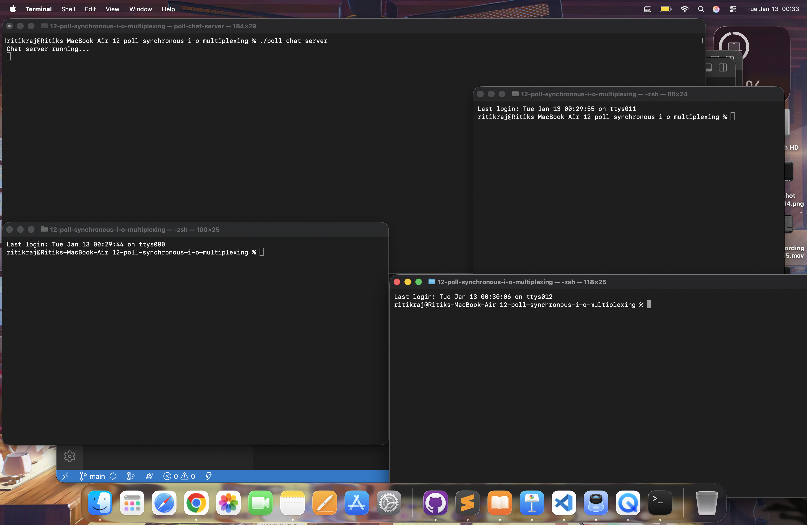
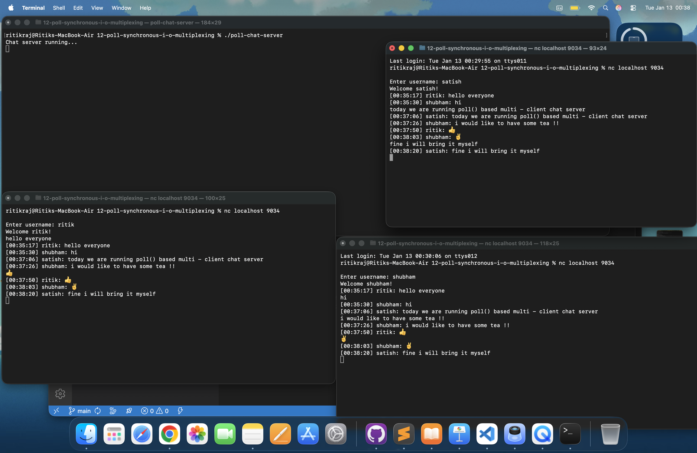
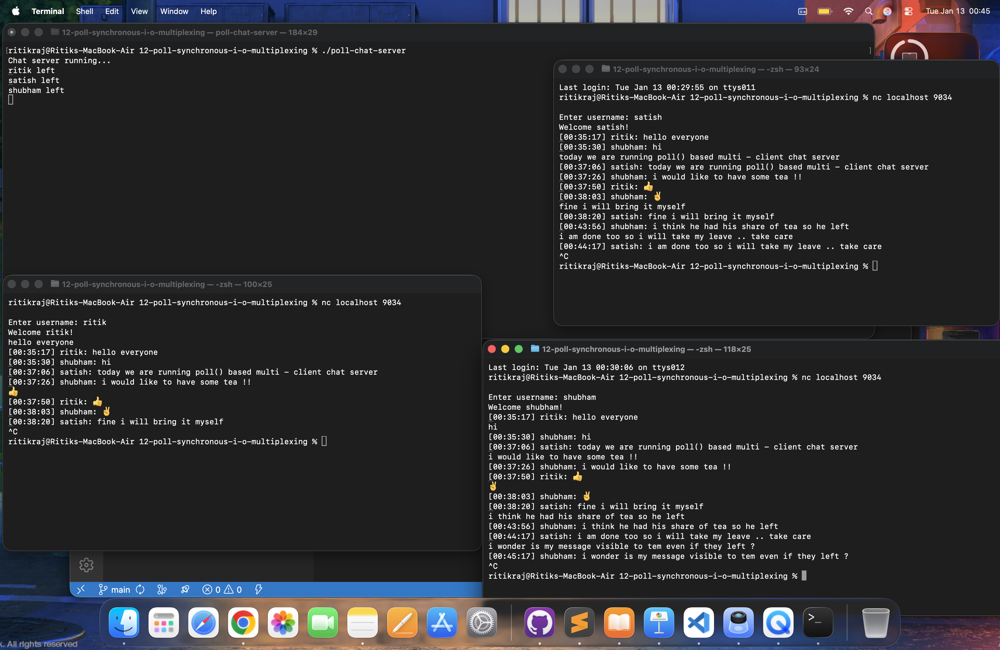

# 🔌 Poll() Based Multi-Client Chat Server (C)

A TCP multi-client chat server built in C using **poll() I/O multiplexing**.  
Supports:
- Multiple simultaneous clients
- Usernames
- Timestamps
- Message broadcasting
- Graceful disconnect handling

This project demonstrates **production-level socket programming concepts**.

---

## 🚀 Features

✔ Handles **multiple clients concurrently**  
✔ Uses **poll()** (no threads, no fork)  
✔ Dynamic socket management  
✔ Username system  
✔ Real-time message broadcasting  
✔ Timestamps on every message  
✔ Detects client disconnects  
✔ Portable (Linux / macOS)

---

## 🛠️ Concepts Used

| Concept | Explanation |
|--------|------------|
| TCP Sockets | Reliable client-server communication |
| getaddrinfo() | IPv4 + IPv6 support |
| poll() | I/O multiplexing |
| File descriptors | Track multiple sockets |
| Dynamic memory | realloc() for growing client list |
| Non-blocking design | Efficient server |
| Structs | Client management |
| Time API | Message timestamps |
| Broadcasting | Server relays messages |
| Graceful cleanup | Close disconnected clients |

---

## 📂 File

|         File            |             Description            |
|-------------------------|------------------------------------|
|    poll-chat-server.c   |   Complete server implementation   |

---

## 📁 Repository Structure

```text
poll-chat-server/
│
├── poll-chat-server.c      
├── README.md            
└── screenshots/            
```

---

## ⚙️ Compilation

```bash
gcc -Wall -Wextra -pedantic poll-chat-server.c -o poll-chat-server
```

---


### ▶️ Run Server

```bash
./poll-chat-server
```

Server listens on port 9034


---

## 💻 Connect Clients

### macOS / Linux

```bash
nc localhost 9034
```

### Windows
```bash
telnet localhost 9034
```

---

### 🧪 Example Flow

Client connects
- Server asks username
- User enters name
- Server welcomes user
- Messages are broadcast
- Timestamps added

---

## 🖼️ Demo

1. Server setup :



2. Server - Client Communicating :




3. Out of three, two users have left :


4. All the users have left but the server is still running



i.e., the server is waiting for any further connections.


---


## 🧠 How It Works

### 1️⃣ poll()

poll() monitors:
- Server socket ( new connections )
- Client sockets ( messages )

No busy waiting.
Efficient & scalable.

---


### 2️⃣ New Client

`accept()`
- add to poll list
- ask username


---

### 3️⃣ Username Handling

First message will be the username

The username is stored in:

```bash
typedef struct {
    int fd;
    char name[32];
} client_t;
```


---


### 4️⃣ Message Broadcast

```bash
for(all clients)
    send(message)
```

Everyone ( including sender ) receives it.

---

### 5️⃣ Timestamp

```bash
strftime("%H:%M:%S")
```

Format:
```bash
[00:37:06] ritik: hello everyone
```

### 6️⃣ Client Disconnect

`recv() <= 0`
- close socket
- remove client

Server logs:
```bash
ritik left
```


---

### 📈 Why poll()?

| Method   | Drawback               |
| -------- | ---------------------- |
| fork()   | heavy processes        |
| threads  | synchronization issues |
| select() | fd limit               |
| poll()   | scalable ✔             |


---


## 🎯 Learning Outcomes
- Low level networking
- Multiplexing
- Memory management
- Event driven server design
- Real world chat server architecture


---
