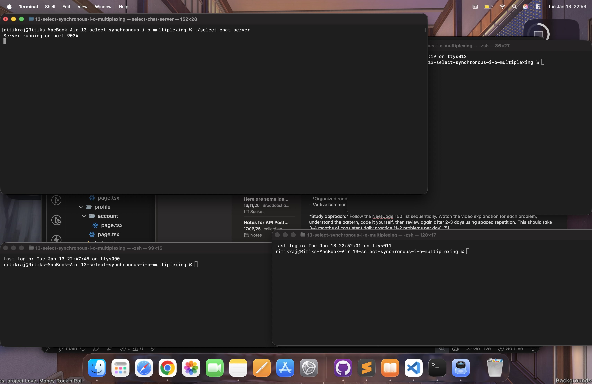
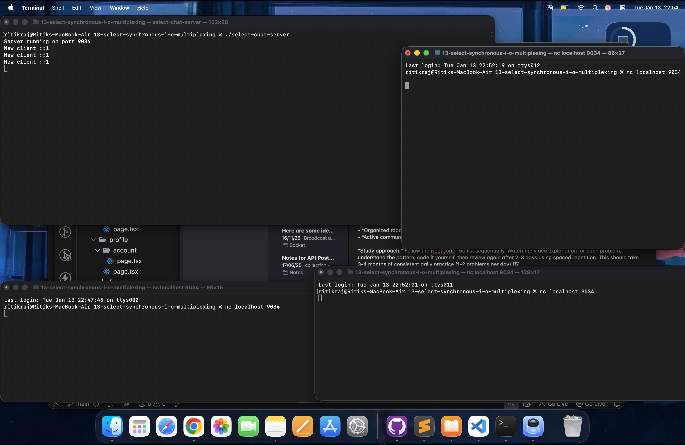
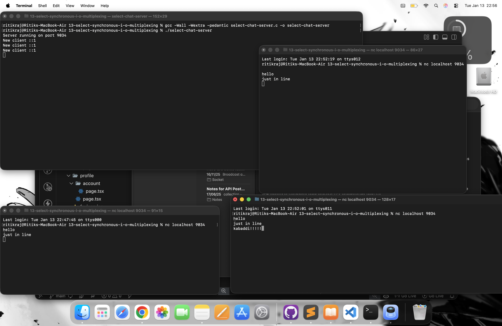
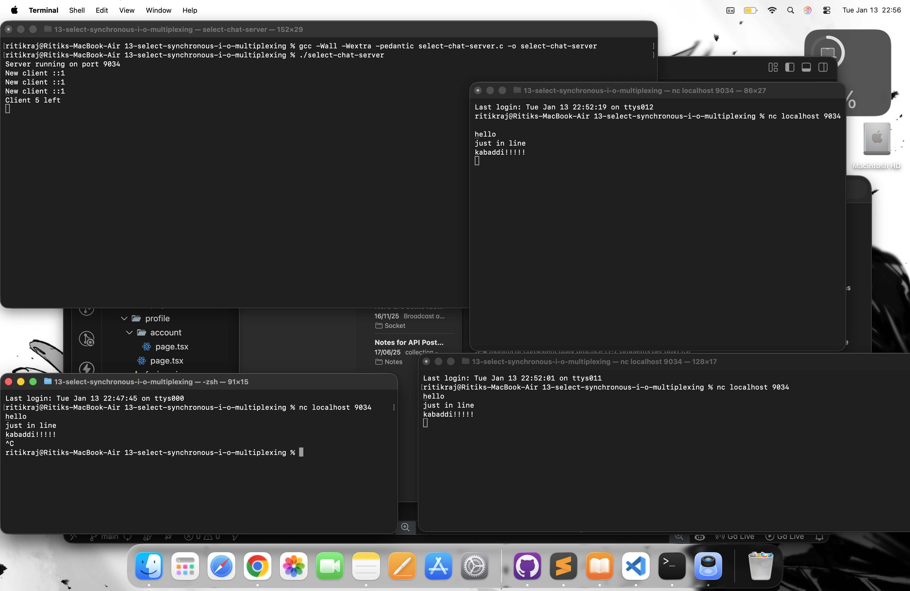
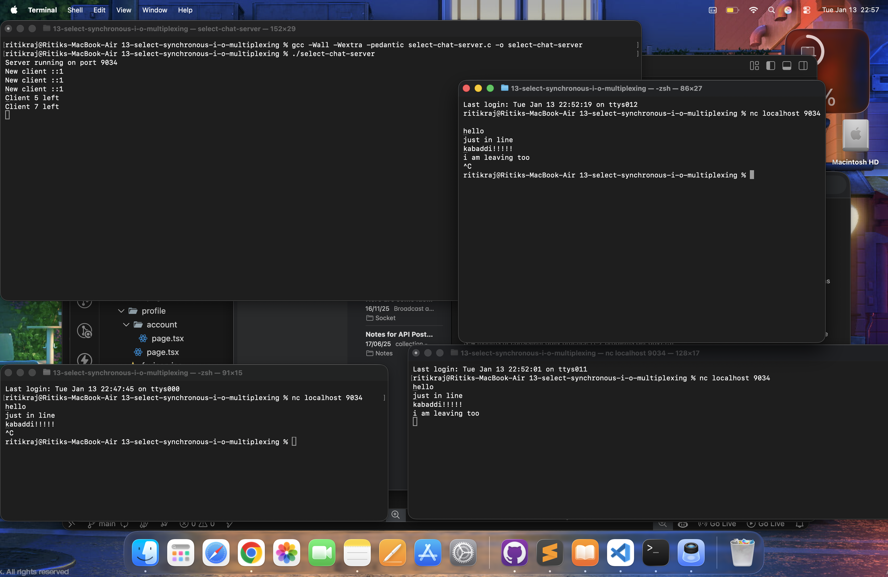
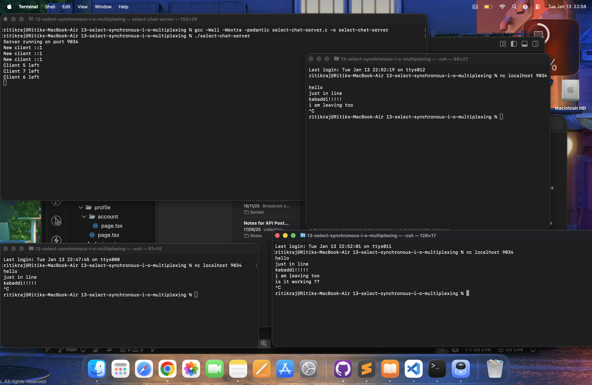

# 🗨️ Multi-Client Chat Server using `select()`

A low-level TCP chat server written in C that supports multiple concurrent clients using I/O multiplexing with `select()`.

This project demonstrates how real production servers manage many clients without threads, using OS-level event notification.

---

## 🚀 Features

- Supports multiple simultaneous clients
- Uses `select()` for I/O multiplexing
- Real TCP sockets ( not simulation )
- Broadcasts messages to all connected users
- Handles client disconnects cleanly
- IPv4 + IPv6 compatible
- No threads -> single event loop


---


## 📂 Project Structure

```bash
select-chat-server/
│
├── select-chat-server.c
├── README.md
└── screenshots/
    ├── server_running.png
    ├── multiple_clients.png
```

---

## ⚙️ How to Run

### 1️⃣ Compile
```bash
gcc -Wall -Wextra -pedantic select-chat-server.c -o select-chat-server
```

### 2️⃣ Start Server
```bash
./select-chat-server
```

Expected output:
```bash
Server running on port 9034
```

### 3️⃣ Connect Clients

Open multiple terminals:
```bash
nc localhost 9034
```

Type messages - they appear on all other clients

---


### 🧠 How It Works

- This server uses event - driven architecture.
- Instead of creating a thread per client, it uses:
    - `select()` → OS tells us which socket is ready

High Level Flow :
```text
1. Create listening socket
2. Add it to master FD set
3. Call `select()` → block
4. Kernel wakes process when:
      - New client arrives
      - Client sends data
5. Process event
6. Repeat forever
```

---


## 🔍 Core Concepts Explained

### 1️⃣ TCP Listener Socket

```bash
listener = socket(...)
bind( listener )
listen( listener )
```

This socket:
- Accepts new connections
- Never sends / receives messages
- Only used for `accept()`

---


### 2️⃣ File Descriptor Sets

We maintain two sets:

```bash
fd_set master;     // permanent list
fd_set read_fds;   // temp copy
```

Why?
- `select()` destroys the set passed
- So we copy before calling it

---


### 3️⃣ select()

```bash
select( fdmax + 1, &read_fds, NULL, NULL, NULL );
```

What happens internally?

|  Step  |   Kernel Action         |
| ------ | ----------------------- |
|   1    |   Process sleeps        |
|   2    |   Network event happens |
|   3    |   Kernel wakes process  |
|   4    |   Marks ready sockets   |
|   5    |   Returns to program    |


This is how Nginx, Redis, Node.js work internally ( event loop ).

---


### 4️⃣ Accepting New Clients

```bash
if( i == listener ) {
    newfd = accept(...)
    FD_SET( newfd, &master );
}
```

When:
- Listener socket becomes readable
- It means new client arrived

---


### 5️⃣ Receiving Client Messages

```bash
recv( i, buf, sizeof buf, 0 );
```

Cases:

| recv() | Meaning             |
| ------ | ------------------- |
| > 0    | Message received    |
| 0      | Client disconnected |
| -1     | Error               |


---

### 6️⃣ Broadcasting Messages

```bash
for(all sockets)
{
    if(client socket)
        send()
}
```

This sends the message to:
- All connected users
- Except sender
- Except listener


---


### 7️⃣ Client Disconnect Handling
```bash
close(i)
FD_CLR(i, &master)
```

Prevents:
- FD leaks
- Ghost connections
- Crashes


---


## 📸 Demo Screenshots


### 1️⃣ Server Socket has been setup :

Chat server successfully started and listening on port 9034.
The server is now waiting for incoming client connections using `select()` based I/O multiplexing.




---


###  2️⃣ Three clients has been setup :


Three clients were connected to the server using `nc localhost 9034`.
This demonstrates how `select()` allows the server to handle multiple active sockets without using threads.
Server logs show the client IP address, proving a real TCP connection was established.





---


###  3️⃣ All the clients are working :

A message sent by one client is broadcast to all other connected clients in real time.
This confirms the server’s broadcasting logic is working correctly.




Different clients sending messages back and forth.
Shows bi - directional communication between server and clients using TCP sockets.


---

### 4️⃣ One of the Client has left :

One client exited the chat session.
Server detected disconnection and removed the socket cleanly using `FD_CLR()`.




### Two Clients has left :

Server console logs showing client socket closed gracefully.
This prevents file descriptor leaks and keeps the server stable.





Rapid connections and disconnections tested. Server continues running without crashing, proving robust event handling.
`select()` wakes up when network activity occurs. Kernel notifies user space that one or more sockets are ready.


---


### 5️⃣ All Clients have left :


Clients manually terminated using `Ctrl+C`.
Server handles abrupt exits safely without memory leaks.



---


