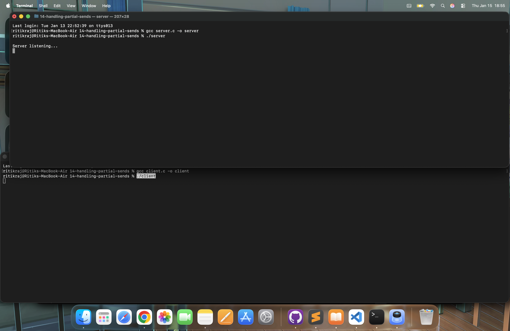
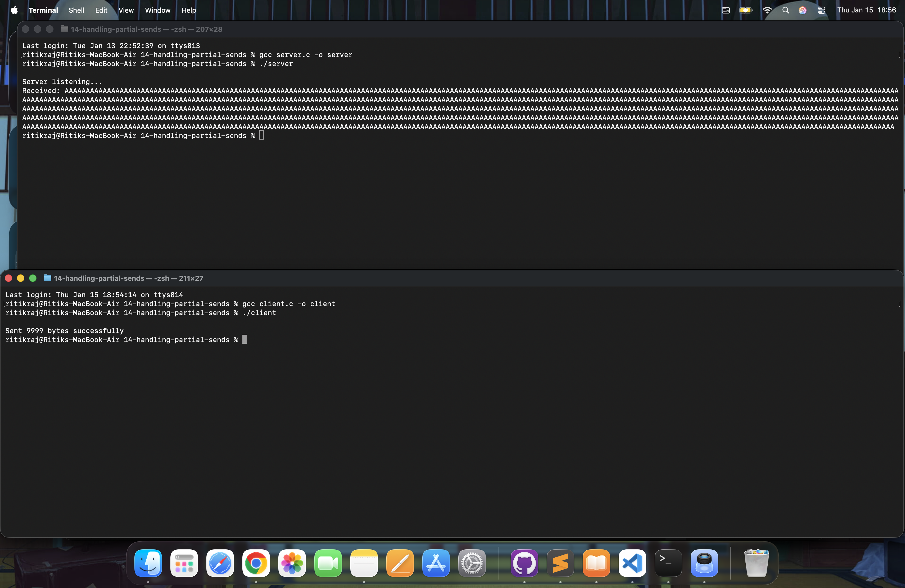

# TCP Client-Server Communication in C

Handling Partial Sends & Reliable Data Transfer

This repository demonstrates a low - level TCP client-server application written in C that focuses on:
- Socket programming fundamentals
- Reliable data transmission
- Handling partial sends using a custom `sendall()` function
- Understanding real - world TCP behavior

This project is built from scratch using Linux / POSIX socket APIs and shows how production systems ensure data integrity over unreliable networks.


---


## 📌 Project Overview

In real networks, `send()` does NOT guarantee that all bytes will be transmitted in one call.
Large messages may be broken into multiple chunks by the OS.

To solve this, we implemented :
    `sendall()` → A custom function that keeps calling send() until all bytes are delivered.


---

## 📂 Project Structure

```text
.
├── screenshots/
├── client.c
├── server.c
└── README.md
```

---

## ⚙️ Compilation

Compile Server :

```bash
gcc server.c -o server```

Compile Client :
```bash
gcc client.c -o client
```

## ▶️ Execution

### Step 1 – Start Server :
```bash
./server
```

Server output:
```bash
Server listening...
```

### Step 2 – Run Client :
```bash
./client
```

Client output:
```bash
Sent 9999 bytes successfully
```

Server output:
```bash
Received: AAAAAAAAAAAAA....
```

---


## 🧠 Core Concepts Implemented

### 1. Socket Creation :

```bash
socket(AF_INET, SOCK_STREAM, 0);
```

Creates a TCP socket : Kernel allocates buffers & TCP state machine


---


### 2. TCP 3-Way Handshake

```bash
connect()
```

Internally:

```text
Client -> SYN
Server -> SYN-ACK
Client -> ACK
```

Connection established


---


### 3. Partial Send Problem

`send()` may send fewer bytes than requested

Why?
- Kernel buffer full
- Network congestion
- OS scheduling


---


### 4. sendall() Solution

```bash
while(total < *len) {
    n = send(s, buf+total, bytesleft, 0);
    total += n;
    bytesleft -= n;
}
```

- Keeps sending remaining bytes
- Guarantees full delivery
- Used in production systems


---


### 5. Server Receiving Data

```bash
recv(newfd, buf, sizeof buf, 0);
```

- Blocks until data arrives
- Reads TCP stream safely


---


## 📸 Output Screenshots

### Server Started

Server waiting for connections.




---


### Client Sending Data

- Client sends 9999 bytes payload.
- Server Receiving
- Server prints full message correctly.



---

### 🔐 Why This Matters in Real Systems

This project teaches real production behavior:

| Concept           | Real-world usage        |
| ----------------- | ----------------------- |
| Partial sends     | HTTP servers, APIs      |
| Socket handling   | Web servers, DB drivers |
| TCP internals     | Cloud services          |
| Reliable delivery | Payment systems         |

---


### 🚀 Skills Demonstrated

- Low-level networking
- Linux system calls
- Memory management
- Kernel-user interaction
- Production-grade reliability
- Debugging network programs


---

