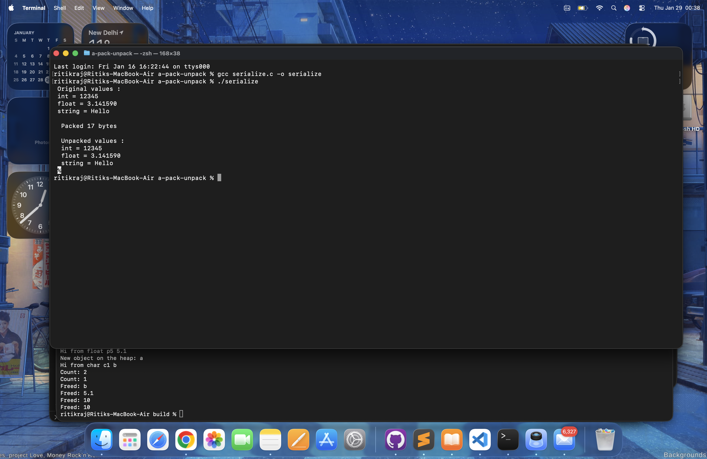

# Binary Serialization in C ( Pack & Unpack Demo )

This project demonstrates how raw data (int, float, string) can be converted into a binary byte buffer and then reconstructed back into original values.

This is the basic idea behind:

- Network packets
- File formats
- Databases
- Game state syncing
- Protocols like Protobuf / MessagePack

Instead of sending text, we send bytes in a defined layout.

---

## What This Program Does

It:
- Takes these values:
    - int num = 12345
    - float pi = 3.14159
    - char msg[] = "Hello"

- Packs them into a byte buffer:
    ```text
    [int (4 bytes)] [float (4 bytes)] [string length (4 bytes)] [string bytes]
    ```
- Then unpacks them from the buffer and prints them again.

---

## Core Idea : Serialization

- Serialization = converting structured data -> into raw bytes
- Deserialization = convert raw bytes -> structured data
- We do this manually using:
    - Bit shifting for integers
    - `memcpy` for floats
    - Length - prefix for strings

---

## Functions Explained

`packi32` : packs a 32 - bit integer into 4 bytes ( big - endian order ) :

```text
buf[0] = val >> 24;
buf[1] = val >> 16;
buf[2] = val >> 8;
buf[3] = val;
```

This makes the integer network - safe and predictable across machines.

---

`unpacki32` : rebuilds the integer from 4 bytes :

```text
( buf[0] << 24 ) | ( buf[1] << 16 ) | ( buf[2] << 8 ) | buf[3];
```

This reverses what packi32 did.

---

`packf` / `unpackf` : They copy raw float bytes using memcpy :

```text 
memcpy( buf, &f, sizeof( float ) );
```

This preserves the IEEE float representation.

---


## Packing Layout

The buffer is filled like this:

```text
| int (4) | float (4) | strlen (4) | string bytes |
```


So for `"Hello"` :

```text
4 bytes  - integer
4 bytes  - float
4 bytes  - length (5)
5 bytes  - 'H' 'e' 'l' 'l' 'o'
```

Total = 17 bytes

---


## Unpacking Logic

We read the buffer in the same order it was written:
- Read 4 bytes -> int
- Read 4 bytes -> float
- Read 4 bytes -> string length
- Read length bytes -> string

This is why layout consistency matters.


---

## How to Run

```text
gcc serialize.c -o serialize
./serialize
```




Expected output:

```text

Original values:
int = 12345
float = 3.141590
string = Hello

Packed 17 bytes

Unpacked values:
int = 12345
float = 3.141590
string = Hello
```


---

### Why This Matters

This is exactly how:
- TCP packets are built
- Game servers sync state
- Databases store records
- Protobuf encodes fields
- Binary file formats work


---

