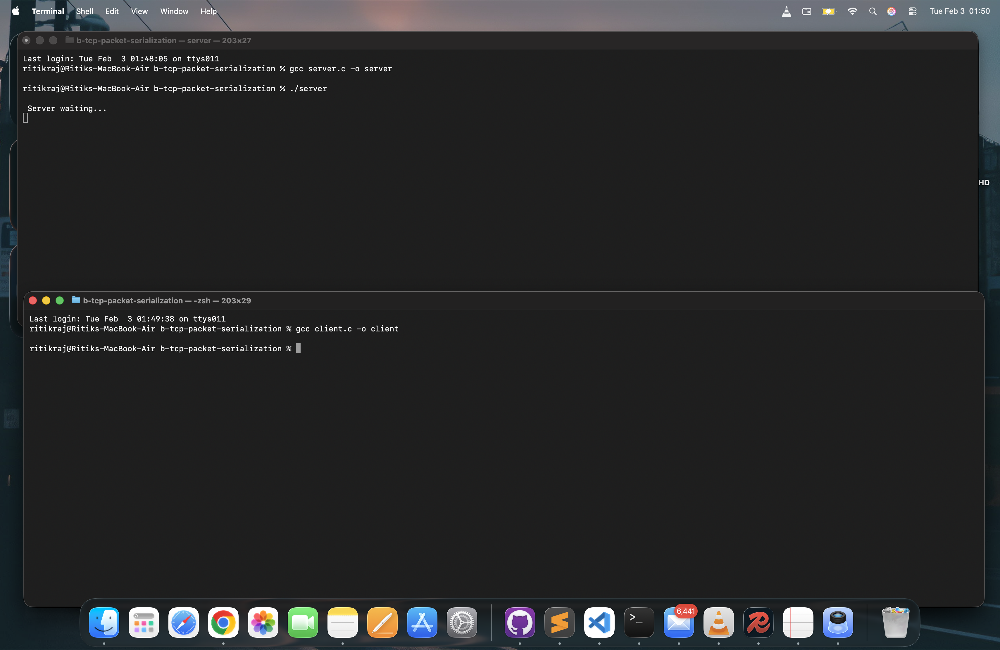
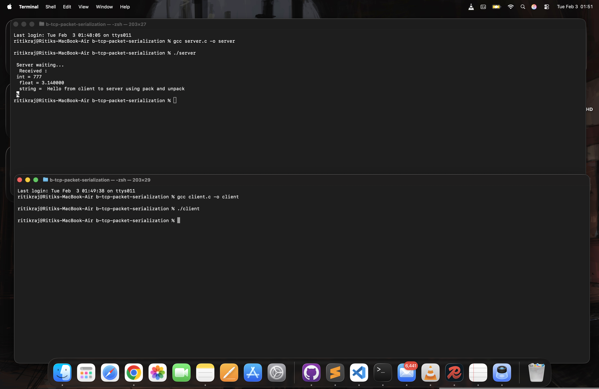

# TCP Packet Serialization in C

This repository demonstrates how to manually serialize and deserialize structured data ( integer, float, and string ) over a TCP connection using the C programming language.

It shows how raw bytes are packed into a buffer on the client side and then unpacked on the server side, similar to how real network protocols and binary formats work internally.

---

## Project Demonstrates

- Manual binary serialization ( packing data into bytes )
- Big - endian integer encoding ( network byte order )
- Sending structured data over TCP
- Deserialization ( reconstructing values from raw bytes )
- Client – server communication using sockets
- How application - level protocols are built

---

## Data Format Used

The client sends a single packet with this layout:

```text
[ int ( 4 bytes ) ]  [ float ( 4 bytes ) ]  [ string length ( 4 bytes ) ]  [ string bytes ]
```

Example:

```text
[ 777 ]  [ 3.14 ]  [ 47 ]  [ "Hello from client to server using pack and unpack" ]
```

This format is interpreted identically on both sides.

---


### File present :

- `client.c`   -> Packs and sends structured data
- `server.c`   -> Receives and unpacks structured data


---


## How Serialization Works

### Packing ( Client Side ) :
- `packi32()` converts a 32 - bit integer into 4 bytes ( big - endian )
- `packf()` copies raw float bytes into the buffer
- The string length is packed before the string itself
- All values are written sequentially into a byte buffer
- The full buffer is sent using `send()`

---

## How Deserialization Works

### Unpacking ( Server Side ) :
- `unpacki32()` reconstructs integers from 4 bytes
- `unpackf()` reconstructs floats using memcpy
- String length is read first to know how many bytes to copy
- The original data is printed after decoding

---

### Build Instructions

Compile the server:
```text
gcc server.c -o server
```

Compile the client:
```text
gcc client.c -o client
```

---


### Run Instructions

- Open two terminals

- Terminal 1 ( for Server ) :
```text
./server
```

- Terminal 2 ( Client ) :
```text
./client
```


--- 


## Screenshots :




This is the setup of the sever for transmission of packed binary data.




This is the working of the server and client connection sharing data in binary form.


---

### Why This Matters

This project demonstrates concepts used in :
- Network protocols ( TCP / UDP packet formats )
- Database storage engines
- Game networking
- Binary file formats
- RPC frameworks
- Serialization libraries ( Protobuf, Thrift, etc. )

Understanding this gives insight into how higher - level systems work internally


---


### Limitations

- Float endianness is not converted ( assumes same architecture )
- No error handling for partial reads / writes
- Single client only
- No framing or checksum

These are intentionally omitted for learning clarity.

---

